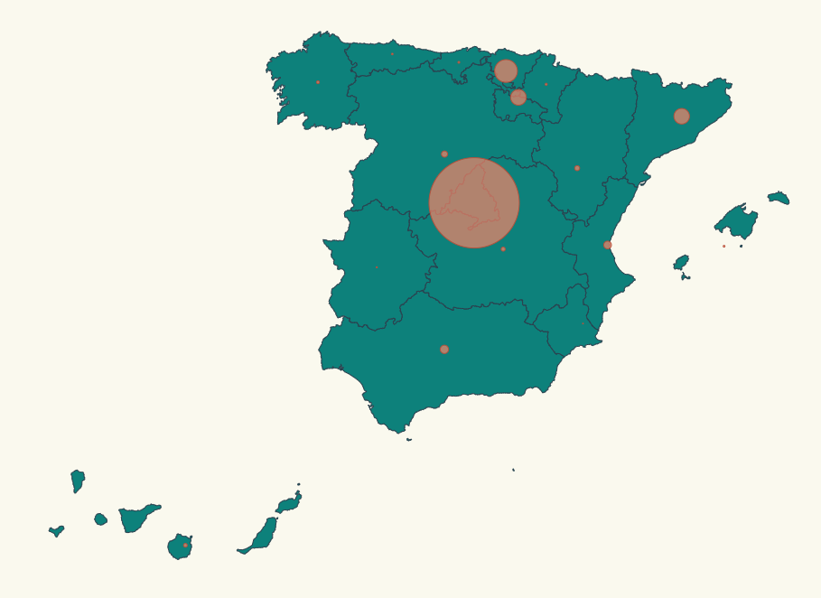

# Coronavirus evolution by autonomous community

In this task we are going to make a comparison of the evolution of the coronavirus by autonomous communities in Spain. To do this, we will show a map showing the localities affected by the virus with a circle and scaling it according to the number of people affected:



codesandbox: https://codesandbox.io/s/hopeful-ellis-rlczx

In order to carry out the exercise we will take into account the following:

- We will take as a starting point the example made in class, where we will have the map of Spain, together with the Canary Islands.
- We will place some pins in the shape of a circle and we will scale it to represent the effect caused by the COVID in each community.
- We will place two buttons to check the difference between the initial COVID data and the current data.

# Steps

- We will start by running the example made in class with the name "02-pin-location-scale" by copying the file and once started in Visual Studio Code, we will run "npm install".

```bash
npm install
```

```typescript
export const latLongCommunities = [
  {
    name: "Madrid",
    long: -3.70256,
    lat: 40.4165,
  },
  {
    name: "Andalucía",
    long: -4.5,
    lat: 37.6,
  },
  {
    name: "Valencia",
    long: -0.37739,
    lat: 39.45975,
  },
  {
    name: "Murcia",
    long: -1.13004,
    lat: 37.98704,
  },
  {
    name: "Extremadura",
    long: -6.16667,
    lat: 39.16667,
  },
  {
    name: "Cataluña",
    long: 1.86768,
    lat: 41.82046,
  },
  {
    name: "País Vasco",
    long: -2.75,
    lat: 43.0,
  },
  {
    name: "Cantabria",
    long: -4.03333,
    lat: 43.2,
  },
  {
    name: "Asturias",
    long: -5.86112,
    lat: 43.36662,
  },
  {
    name: "Galicia",
    long: -7.86621,
    lat: 42.75508,
  },
  {
    name: "Aragón",
    long: -1.0,
    lat: 41.0,
  },
  {
    name: "Castilla y León",
    long: -4.45,
    lat: 41.383333,
  },
  {
    name: "Castilla La Mancha",
    long: -3.000033,
    lat: 39.500011,
  },
  {
    name: "Islas Canarias",
    long: -15.5,
    lat: 28.0,
  },
  {
    name: "Islas Baleares",
    long: 2.52136,
    lat: 39.18969,
  },
  {
    name: "Navarra",
    long: -1.65,
    lat: 42.816666,
  },
  {
    name: "La Rioja",
    long: -2.445556,
    lat: 42.465,
  },
];
```

-Once we have copied the information we need, we import it into our "index.ts" file.

```diff
import * as d3 from "d3";
import { stat } from "fs";
import * as topojson from "topojson-client";
import { latLongCommunities } from "./communities";
import { stats, stats_1, ResultEntry } from "./stats";
```

-Now we will import the data we have copied in "spain.json" as a variable called "spainjson" and another variable "d3Composite" to project in d3.

```diff
const spainjson = require("./spain.json");
const d3Composite = require("d3-composite-projections");
```

-After that we will create a variable where we will reduce our COVID cases to find the maximum number of affected people.

```diff
const maxAffected = stats.reduce(
  (max, item) => (item.value > max ? item.value : max),
  0
);
```

-A scale will then be made to calculate the radius size of the circles to be represented on the map.

```diff
const affectedRadiusScale = d3
  .scaleLinear()
  .domain([0, maxAffected])
  .range([10, 30]);
```

-We will create a function that will help us to represent the name of the communities but we will use it in the following tasks:

```diff
 const calculateRadiusBasedOnAffectedCases = (
  community: string,
  dataset: ResultEntry[]
) => {
  const entry = dataset.find((item) => item.name === community);

  return entry ? affectedRadiusScale(entry.value) : 0;
};
```

-Finally, we will create the variables to be able to build our environment where we will show our design.

-We will start building the background where we will load our map:

```diff
const svg = d3
  .select("body")
  .append("svg")
  .attr("width", 1024)
  .attr("height", 800)
  .attr("style", "background-color: #FBFAF0");
```

-Followed by the map projection, with a scale for the size of the map we are going to represent and the position manually so that it is as centred as possible:

```diff
const aProjection = d3Composite
  .geoConicConformalSpain()
  .scale(3300)
  .translate([500, 400]);
```

-And we finish with the projection of the map with the information gathered from the topojson:

```diff
const geoPath = d3.geoPath().projection(aProjection);
const geojson = topojson.feature(spainjson, spainjson.objects.ESP_adm1);
```

-First we create the body where we will display the data to represent the country and communities:

```diff
svg
  .selectAll("path")
  .data(geojson["features"])
  .enter()
  .append("path")
  .attr("class", "country")
  .attr("d", geoPath as any);
```

-Second we create the circles that we will represent them in the country created in the previous code, in this case I have been helped by the laboratory professor David Cuesta, since he advised me that for each time that I loaded the map and each time I was going to load the circles, these were removed so that there were no problems at the time of loading them:

```diff
const updateChart = (data: ResultEntry[]) => {
  svg.selectAll("circle").remove();
  svg
    .selectAll("circle")
    .data(latLongCommunities)
    .enter()
    .append("circle")
    .attr("class", "affected-marker")
    .attr("r", (d) => calculateRadiusBasedOnAffectedCases(d.name, data))
    .attr("cx", (d) => aProjection([d.long, d.lat])[0])
    .attr("cy", (d) => aProjection([d.long, d.lat])[1]);
};
```

-We would finish this task by creating the buttons that are requested in the statement. To do this, we must first create these buttons in the html file "index.html":

```diff
  <div>
        <button id="Init">InitlyCovid</button>
        <button id="Currently">CurrentlyCovid</button>
  </div>
```

-And we would display them on our map as follows:

```diff
document
  .getElementById("Init")
  .addEventListener("click", function ResultsInitCovid() {
    updateChart(stats);
  });

document
  .getElementById("Currently")
  .addEventListener("click", function ResultsCurrentlyCovid() {
    updateChart(stats_1);
  });
```

-To see the final result, run the code:

```bash
npm start
```

where we load the map in the path "localhost:1234".
